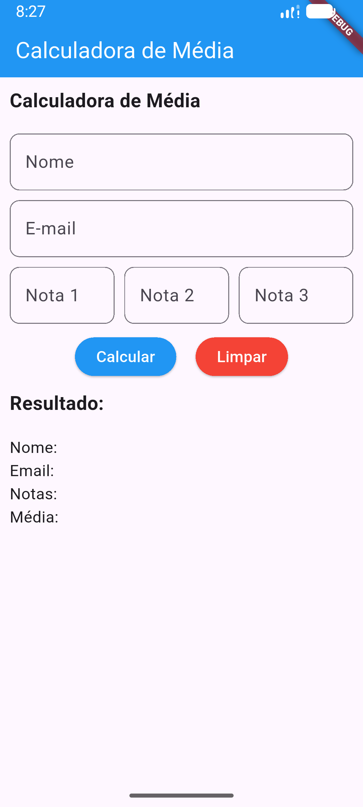
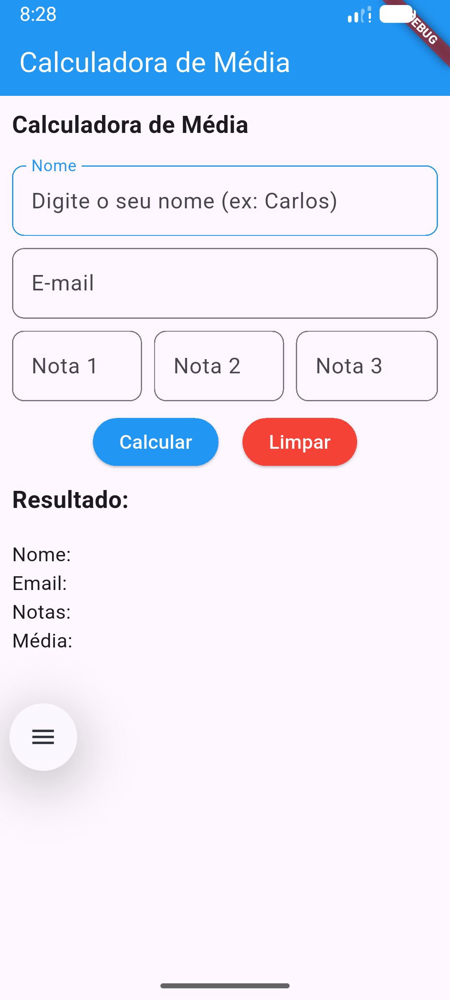
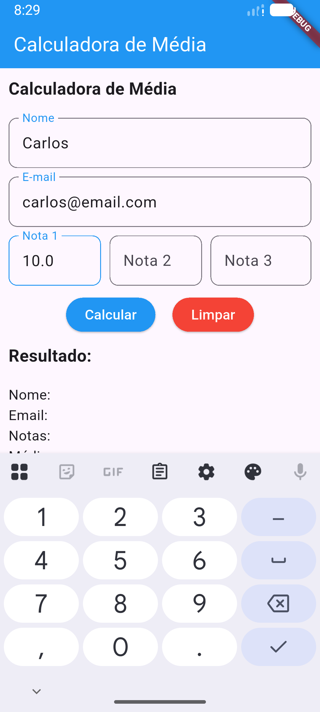
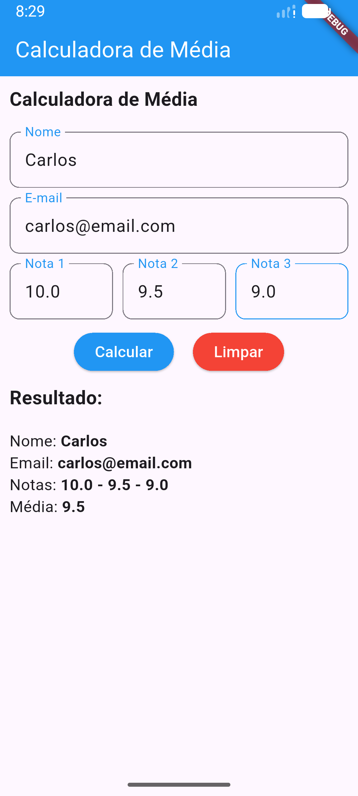

# Calculadora de Média

## Introdução

Este é um aplicativo desenvolvido em Flutter como parte dos estudos da disciplina Desenvolvimento Multiplataforma 1 do curso de Especialização em Desenvolvimento de Sistemas para Dispositivos Móveis do IFSP - Câmpus São Carlos.

O objetivo deste projeto é desenvolver uma interface de usuário (UI), explorando widgets do Flutter e componentes baseados no Material Design. Além disso, o projeto trabalha diretamente com `StatefulWidget` e `State`, utilizando o gerenciamento de estado para criar uma aplicação mais dinâmica, capaz de atualizar os dados exibidos na tela conforme a interação do usuário.

## Sobre o aplicativo

A aplicação permite informar nome, e-mail e três notas. Ao acionar o botão de cálculo, o aplicativo processa os valores informados e exibe o resultado da média diretamente na interface.

Também há a opção de limpar os campos preenchidos e reiniciar os dados apresentados, reforçando o uso de estado para controlar as mudanças visuais e comportamentais da tela.

## Screenshots

  
  
  
  

